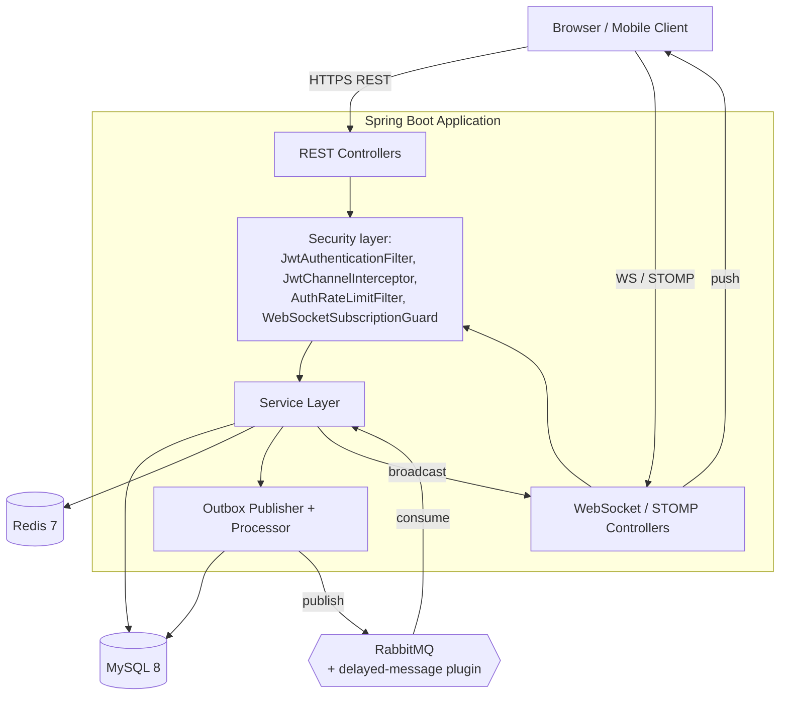
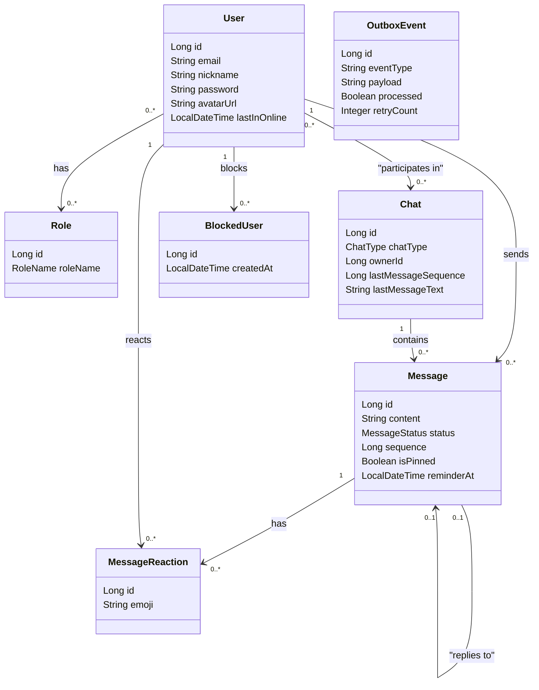

# 💬 Bingo Chat Application — Spring Boot Back-End

[](https://github.com/VitaliyProgrammer/bingo-chat-application/actions/workflows/ci.yml)


## 📌 Introduction

**Bingo Chat Application** is a production-style back-end for a real-time messenger,
built with Spring Boot. It's not a CRUD demo with a WebSocket bolted on - the point
of the project is everything that makes a chat product actually survivable in
production: guaranteed message delivery even if a broker or the app itself crashes
mid-flight, correct behavior under concurrent writers, rate limiting against abuse,
and a security layer that was tested against real attack-shaped inputs, not just
happy paths.

The full technical breakdown lives in [`docs/`](docs/01-overview.md) - this README
is the map, not the territory.

## 🎯 What this project demonstrates

- 🧩 Two independent, correctly-scoped authentication mechanisms for two transports
  that don't share a threading model (REST vs STOMP/WebSocket)
- 📡 Reliable, at-least-once event delivery via the **Outbox pattern**, backed by a
  real broker (RabbitMQ) with a scheduled fallback so nothing gets silently lost
- 🔒 Concurrency correctness proven against a **real** database under real concurrent
  load (Testcontainers), not assumed from reading the code
- 🐛 A real, self-discovered production bug (non-atomic Redis rate-limit counter that
  could permanently lock a user out) - found, fixed with an atomic Lua script, and
  covered by a regression test
- ⚙ Idempotency and distributed locking with Redis, so the system is safe to scale
  to multiple instances without double-processing anything
- 🧪 A test suite split by cost: fast mocked unit/slice tests on every `mvn test`,
  and a separate Testcontainers integration suite on `mvn verify` for the things a
  mock structurally cannot prove

## 🧩 Features

**💬 Messaging**
- Private and group chats, with transferable group ownership
- Real-time delivery over WebSocket/STOMP with `SENT → DELIVERED → READ` tracking
- Message editing, pinning, replies, and capped emoji reactions in group chats
- Typing indicators, online presence, delayed reminders
- Web Push notifications for offline participants

**🛡 Moderation & safety**
- User-to-user blocking, enforced on both messaging and group invites
- Admin-only group moderation, protected by tested method-level authorization
- Rate limiting on auth endpoints and WebSocket subscribe/send, against brute-force and flood

**🔁 Reliability**
- Outbox pattern: a message is never "sent" without a guaranteed delivery event
- Scheduled fallback re-processes anything the fast async path missed
- Idempotency guards on every consumer against at-least-once redelivery

## 🏗 Architecture at a glance



Full sequence diagrams for authentication (HTTP vs WebSocket) and the complete
message send-to-delivery pipeline are in
[`docs/02-architecture.md`](docs/02-architecture.md).

## 🧱 Domain model



## 🧰 Technology stack

| Layer | Technology |
|---|---|
| Language / runtime | Java 17 |
| Framework | Spring Boot 3.2.4 |
| Real-time transport | WebSocket + STOMP |
| Security | Spring Security, JWT (jjwt), BCrypt |
| Persistence | Spring Data JPA / Hibernate, MySQL 8, Liquibase |
| Caching & ephemeral state | Redis 7 |
| Messaging | RabbitMQ + delayed-message plugin, Spring AMQP |
| Mapping | MapStruct, Lombok |
| Docs & observability | springdoc-openapi (Swagger), Actuator, Micrometer + Prometheus |
| Push notifications | Web Push (VAPID) |
| Testing | JUnit 5, Mockito, AssertJ, MockMvc, Testcontainers |
| Build & quality | Maven (Surefire + Failsafe), Checkstyle |
| Deployment | Docker (multi-stage build), Docker Compose |

Full stack breakdown with the reasoning behind every choice:
[`docs/03-tech-stack.md`](docs/03-tech-stack.md).

## 🐳 Infrastructure & Deployment

Docker Compose orchestrates the entire stack - app, MySQL, Redis, and RabbitMQ -
with dependency-aware healthchecks, so the app container only starts once every
dependency is actually ready, not just "started".

## 🛠 Getting started

**Prerequisites:** Docker, Docker Compose, a browser.

```bash
git clone https://github.com/VitaliyProgrammer/bingo-chat-application.git
cd bingo-chat-application
docker-compose up --build
```

Once it's up:

| What | Where |
|---|---|
| Swagger UI | `http://localhost:8080/swagger-ui/index.html` |
| Health check | `http://localhost:8080/actuator/health` |
| STOMP test page | `http://localhost:8080/stomp-test.html` |

```bash
docker-compose down   # stop everything
```

## 🧪 Testing

```bash
mvn test      # fast unit + slice tests (Mockito, MockMvc) - no Docker required
mvn verify    # + integration tests against real MySQL/Redis/RabbitMQ (Testcontainers)
```

The integration suite exists specifically to prove what a mock structurally can't:
that a `SELECT ... FOR UPDATE` lock actually serializes concurrent writers, that a
Redis rate-limit counter is atomic under real concurrent load, and that hand-written
JPQL joins return correct rows against a real database.

## 📘 Documentation

- [**Overview & features**](docs/01-overview.md) — what the project does, quick start, how to run the tests
- [**Architecture**](docs/02-architecture.md) — authentication flows, message delivery pipeline, concurrency patterns, data model
- [**Tech stack**](docs/03-tech-stack.md) — every technology used, and why
