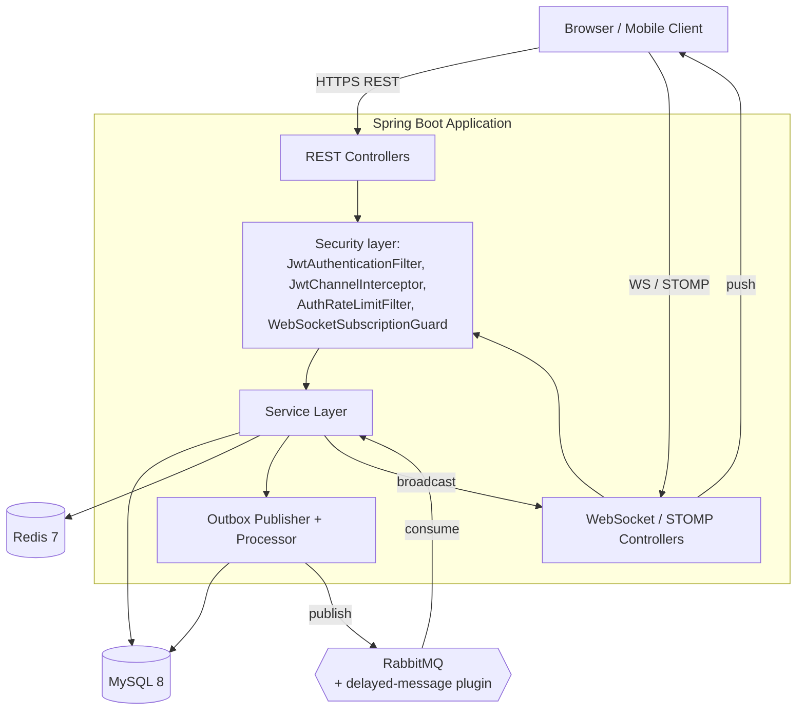
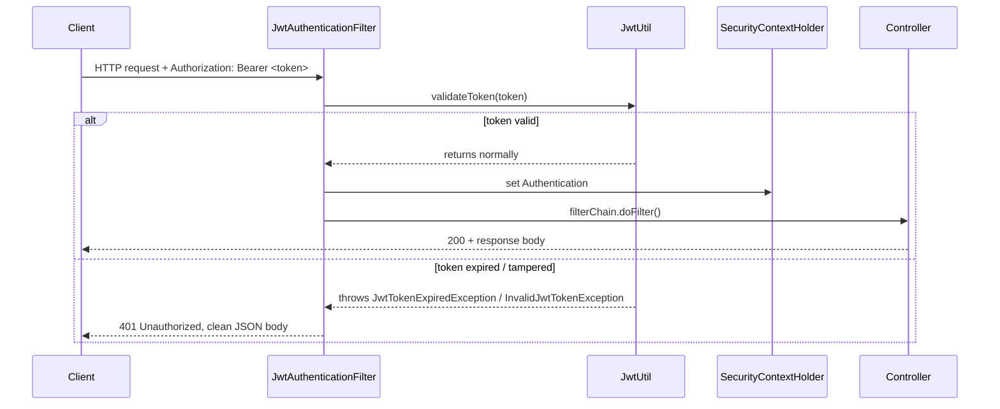
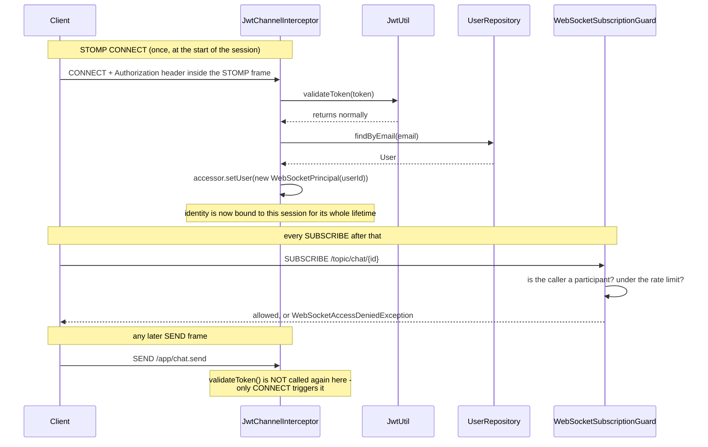
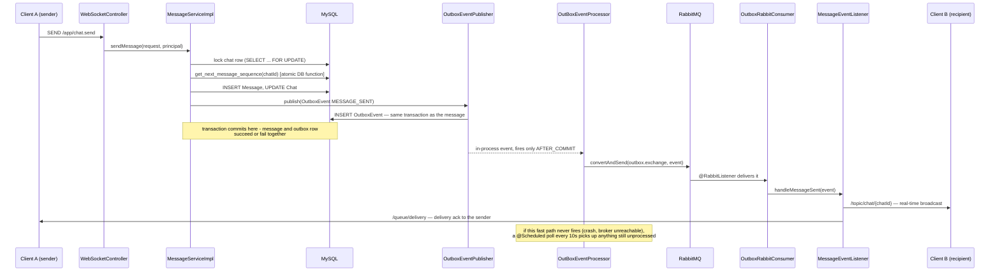
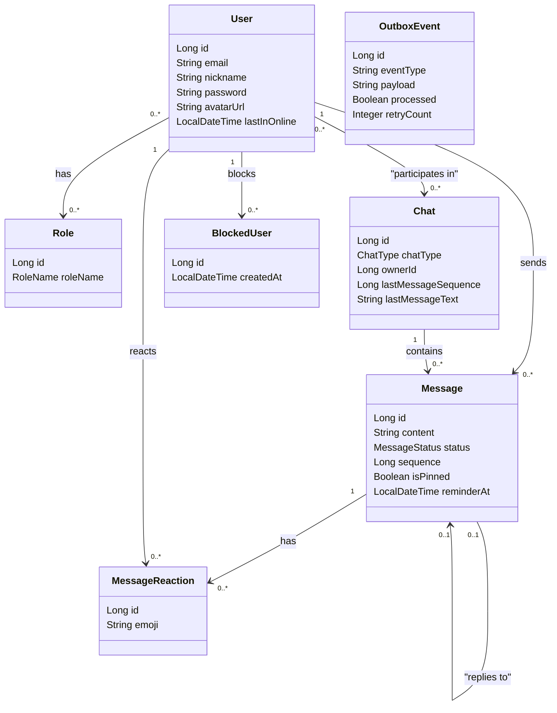

# Architecture — how it works under the hood

This document walks through the parts of the system that aren't obvious from the
API surface alone: how authentication differs between REST and WebSocket, how a
message actually gets from one client's screen to another's, and why certain
decisions (Outbox pattern, pessimistic locking, distributed locks) exist at all.

## 1. Component overview

## 2. Authentication — two independent mechanisms

REST and WebSocket don't share an authentication path, because they don't share a
threading model. `SecurityContextHolder` is backed by a `ThreadLocal` - it lives for
the duration of one HTTP request on one thread. STOMP frames over an already-open
WebSocket connection are handled on a completely different thread pool
(`clientInboundChannel`), where that `ThreadLocal` was never populated. So the two
paths are deliberately separate components.

### 2.1 REST (HTTP)

`JwtAuthenticationFilter` runs before `DispatcherServlet` in the filter chain, so a
`@RestControllerAdvice` never gets a chance to handle anything it throws - the
filter has to catch and translate its own exceptions into an HTTP response itself.

### 2.2 WebSocket (STOMP)

That last note is a deliberate, documented trade-off, not an oversight: a token that
expires mid-session is not re-checked on every frame. It's covered by a test
(`JwtChannelInterceptorTest.preSend_sendCommandWithExpiredToken_isNeverRevalidated`)
specifically so the behavior is visible and intentional rather than an unverified
assumption.

## 3. Sending a message: from click to the other screen

### Why Outbox instead of just publishing directly?

If `sendMessageInternal()` called `messagingTemplate.convertAndSend(...)` directly,
and the process crashed - or RabbitMQ was briefly unreachable - right after the
database commit, the message would exist in the database but nobody would ever be
told to deliver it. The Outbox pattern turns "deliver this" into a row in the same
transaction as the business data: either both the message and the delivery
obligation are committed together, or neither is. Publishing to RabbitMQ is a
separate, retryable step that can safely happen after the fact without risking data
loss - and if the fast, event-driven path misses it, the scheduled poller in
`OutBoxEventProcessor.process()` guarantees it still goes out, just up to 10 seconds
later.

Every consumer (`OutboxRabbitConsumer`, `RemindersRabbitConsumer`, and each handler
inside `MessageEventListener`) additionally checks a Redis idempotency key before
acting, since RabbitMQ and the retry logic both guarantee **at-least-once**
delivery, not exactly-once - a message can legitimately be redelivered, and nothing
should be broadcast to a client twice because of it.

## 4. Reliability & concurrency patterns, in one table

| Pattern | Where | What it prevents |
|---|---|---|
| Outbox Pattern | `OutboxEventPublisher` + `OutBoxEventProcessor` | Losing a delivery event if the app crashes between the DB commit and publishing to RabbitMQ |
| Pessimistic row lock | `chatRepository.lockChatForUpdate()` | Two concurrent messages in the same chat getting the same `sequence` number |
| Atomic DB function | `get_next_message_sequence()` (MySQL) | The increment-then-read race that a plain `SELECT MAX(sequence)+1` would have under load |
| Distributed lock via Redis | `SchedulerLockManager` | Two application instances running the same `@Scheduled` job at once, if the app is ever scaled horizontally |
| Idempotency keys (Redis `SETNX`) | Every RabbitMQ consumer | Broadcasting the same event twice after an at-least-once redelivery |
| Atomic rate-limit counter (Redis Lua script) | `RedisServiceImpl.isAllowed()` | A window where a crash between `INCR` and `EXPIRE` would leave a key permanently stuck past its limit |
| TTL-based presence | `RedisService.setUserOnline()` | Needing an explicit disconnect signal - a client that vanishes (crash, dead network) just stops renewing the key and "goes offline" on its own |

## 5. Data model

`OutboxEvent` is deliberately not linked to the other entities above - it's not a
domain relationship, it's an infrastructure record (event type, JSON payload,
processing state) written in the same transaction as whatever business change
triggered it. See section 3 for how it's actually used.
